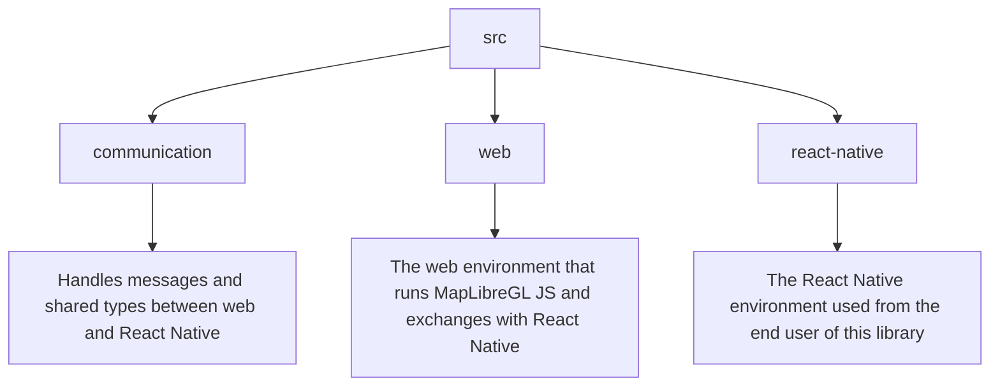

# react-native-maplibre-gl-js


![Web Support](https://img.shields.io/badge/Web_support_✗-red?style=for-the-badge&logo=data%3Aimage%2Fsvg%2Bxml%3Bbase64%2CPHN2ZyB4bWxucz0iaHR0cDovL3d3dy53My5vcmcvMjAwMC9zdmciIHZpZXdCb3g9IjAgMCAyNCAyNCI%2BPHBhdGggZmlsbD0iI2ZmZiIgZD0iTTE2LjM2LDE0QzE2LjQ0LDEzLjM0IDE2LjUsMTIuNjggMTYuNSwxMkMxNi41LDExLjMyIDE2LjQ0LDEwLjY2IDE2LjM2LDEwSDE5Ljc0QzE5LjksMTAuNjQgMjAsMTEuMzEgMjAsMTJDMjAsMTIuNjkgMTkuOSwxMy4zNiAxOS43NCwxNE0xNC41OSwxOS41NkMxNS4xOSwxOC40NSAxNS42NSwxNy4yNSAxNS45NywxNkgxOC45MkMxNy45NiwxNy42NSAxNi40MywxOC45MyAxNC41OSwxOS41Nk0xNC4zNCwxNEg5LjY2QzkuNTYsMTMuMzQgOS41LDEyLjY4IDkuNSwxMkM5LjUsMTEuMzIgOS41NiwxMC42NSA5LjY2LDEwSDE0LjM0QzE0LjQzLDEwLjY1IDE0LjUsMTEuMzIgMTQuNSwxMkMxNC41LDEyLjY4IDE0LjQzLDEzLjM0IDE0LjM0LDE0TTEyLDE5Ljk2QzExLjE3LDE4Ljc2IDEwLjUsMTcuNDMgMTAuMDksMTZIMTMuOTFDMTMuNSwxNy40MyAxMi44MywxOC43NiAxMiwxOS45Nk04LDhINS4wOEM2LjAzLDYuMzQgNy41Nyw1LjA2IDkuNCw0LjQ0QzguOCw1LjU1IDguMzUsNi43NSA4LDhNNS4wOCwxNkg4QzguMzUsMTcuMjUgOC44LDE4LjQ1IDkuNCwxOS41NkM3LjU3LDE4LjkzIDYuMDMsMTcuNjUgNS4wOCwxNk00LjI2LDE0QzQuMSwxMy4zNiA0LDEyLjY5IDQsMTJDNCwxMS4zMSA0LjEsMTAuNjQgNC4yNiwxMEg3LjY0QzcuNTYsMTAuNjYgNy41LDExLjMyIDcuNSwxMkM3LjUsMTIuNjggNy41NiwxMy4zNCA3LjY0LDE0TTEyLDQuMDNDMTIuODMsNS4yMyAxMy41LDYuNTcgMTMuOTEsOEgxMC4wOUMxMC41LDYuNTcgMTEuMTcsNS4yMyAxMiw0LjAzTTE4LjkyLDhIMTUuOTdDMTUuNjUsNi43NSAxNS4xOSw1LjU1IDE0LjU5LDQuNDRDMTYuNDMsNS4wNyAxNy45Niw2LjM0IDE4LjkyLDhNMTIsMkM2LjQ3LDIgMiw2LjUgMiwxMkExMCwxMCAwIDAsMCAxMiwyMkExMCwxMCAwIDAsMCAyMiwxMkExMCwxMCAwIDAsMCAxMiwyWiIgLz48L3N2Zz4%3D&logoColor=red&labelColor=black)


A TypeScript library to enable the use of [MapLibre GL JS](https://github.com/maplibre/maplibre-gl-js) within React Native.
Aims to bring all the web features into React Native components, thereby
offering new capabilities to React Native developers.

**This library is not an official MapLibre project.**


## Installation

** TODO not available on npm yet **

```sh
npm install react-native-maplibre-gl-js
```

## Usage

Here is a straightforward example to get started with a basic map. Every element
from this library needs to be placed inside a `MapProvider` component.

```js
import RNMapLibreGlJs from 'react-native-maplibre-gl-js';

export const MyMapComponent = () => {
  return (
    <RNMapLibreGlJs.MapProvider>
      <RNMapLibreGlJs.Map
        // The MapLibre options, as specified in the official MapLibre GL JS
        // documentation.
        options={{
          style: YOUR_MAP_STYLE_URL,
          center: [2.32, 48.86],
          zoom: 12,
        }}
        // Listeners for various map events, also specified in the official
        // docsumentation.
        listeners={{
          click: {
            objectListener: (event: MapMouseEvent) =>
              console.log('Map clicked', event),
          },
        }}
      />
    </RNMapLibreGlJs.MapProvider>
  )
}
```

A lot of usage scenarios are available in the [`examples` folder](./example). One
can read the example files, but the example can also be run directly as an
expo app:

```sh
cd example
npm install
npx expo start
```

** TODO insert app glossary menu screenshots **

## Documentation

** TODO insert link to generated docs **


## How it works

### The main library mechanism

The library exposes React Native components that wrap MapLibre GL JS classes.
To communicate between the React Native world and the MapLibre GL JS (web)
world, the library uses a WebView component that runs the MapLibre GL JS code.
This WebView is wrapped within a `MapProvider` component that manages messages
between the two worlds. Then, within the provider, one can insert MapLibre GL JS
components such as `Map`, `Marker`, `Popup`, etc. as direct children.

### The React Native components

A component provided by this library is made of two parts:
- Props that are made of `options` and `listeners` based on the underlying
  MapLibre GL JS object.
- Ref that exposes methods and properties of the underlying MapLibre GL JS
  object.

When the component mount for the first time, a message is sent to the WebView,
through the `MapProvider`, to create the corresponding MapLibre GL JS
object with the `options` provided in props. Then, the web object subscribes to
the events specified in the `listeners` property.

When a component method is called, a message is sent through the `MapProvider`
to the WebView, where the corresponding MapLibre GL JS method is called. Then,
the result is sent back to the React Native world and returned to the caller
using a `Promise`.

The same mechanism is used for the listeners. When an event is triggered in the
WebView, a message is sent to the React Native world, where the corresponding
listener is called.

### TypeScript support

TypeScript usage makes it possible to infer every method, property and event
listener available on each component. These are directly mapped to the official
MapLibre GL JS documentation, with some adjustments to make it work in React
Native. The methods, properties and listeners that are modified are available in
the `{ComponentName}.types.ts` file.

### The code structure



The JS code that runs within the WebView is bundled using the script in the
[`scripts` folder (build.js)](./scripts/build.js). The generated code is in the
[`generated` folder](./src/web/generated). The main class being used by the code
is [`MapController`](./src/web/maplibre-gl-js/MapController.ts).

The types and messages that are sent to and by the WebView are stored within the
[`communication` folder](./src/communication).

### Developer jargon

The following terms are used throughout the documentation and codebase.

| Name       | Definition                                                                                                                                                                           |
|------------|--------------------------------------------------------------------------------------------------------------------------------------------------------------------------------------|
| RN world   | The React Native environment.                                                                                                                                                        |
| Web world  | The JS that runs within the React Native WebView (i.e. the code that runs the underlying MapLibre GL JS library). The corresponding code is stored in the [`web` folder](./src/web). |
| Web object | A MapLibre GL JS object running in the web world. The corresponding code is stored in the [`react-native` folder](./src/react-native).                                               |

### Current status

The following table lists the MapLibre GL JS classes that are not implemented
because they are not relevant in a React Native context.

| Unsupported class | Reason                                                                 |
|-------------------|------------------------------------------------------------------------|
| Hash              | Update Browser URL but the browser URL of this library is not visible. |

The following table lists the MapLibre GL JS classes that are implemented yet.

| To be implemented class |
|-------------------------|
| VectorTileSource        |
| RasterTileSource        |
| RasterDEMTileSource     |
| GeoJSONSource           |
| ImageSource             |
| VideoSource             |
| **TODO controls**       |


## Motivations

### My "state of the art" of the existing solutions

Considering tile-based maps, these are the maintained or supported libraries
that can be used in React Native. Each has its strengths, and credit goes to
their contributors. Still, I have highlighted what I consider to be  their main
drawbacks to explain why I decided to build a new one.

#### `react-native-maps` or `Expo maps`

To achieve the wanted result, one should overlay the custom tiles on Apple plan
(iOS) or Google Maps (iOS/Android).

- On tile loading, the map below (Google maps or Apple plan) is visible.
- If the map provider is Google Maps (mandatory on the Android platform) an API
  key is needed to use Google maps SDK, and therefore its use is billed.
-
#### `@rnmapbox/maps`

- Dependence on Mapbox choices.
- On the latest versions, an API key is required (at least on the Android side
  that drops the MapLibre SDK support), and therefore its use is billed.
- To render animated markers or markers with dynamic content and developed
  visual styles, the use of native views is necessary, and this greatly slows
  down the application.
-
#### `maplibre-react-native`

- Being an open source fork of MapBox, the library is years behind (1000+
  commits to date) and lacks many features and bug fixes.
- The same performance issue with native views as `@rnmapbox` is also
  present.

### What I think it can be done

To address these drawbacks, two main approaches are possible (as far as I know):
either build a library on top of native views using free mobile SDKs (such as
MapLibre Native, meaning the effort should instead go into improving
`maplibre-react-native`), or leverage existing web-based map libraries.

The second option is far easier to build and maintain, since it relies on a
single rendering engine rather than separate iOS and Android SDKs. It also opens
the door to fixing performance issues and limitations found in earlier
libraries, while enabling more features.

I outline two solutions in this category below, along with the issues they still
carry.

#### Host a map on a web page, and access it through a WebView

- Requires additional infrastructure.
- Very sensitive to network latency, and in general, a degraded user experience.
- Offline usage is not possible.

#### Inject bundled JS within a WebView

- Any interaction between the WebView content and the React Native world is made
  through message-passing, which can make certain interactions more indirect.
- Some objects cannot be serialized and sent between the WebView code and React
  Native (e.g. HTMLElement).

Some GitHub repositories are implementing this solution however no one are
actively maintained, and the underlying web libraries are missing key features
— good examples being `react-native-leaflet-view` and
`@neukolabs/react-native-maplibre-js`.

This is the solution implemented by this library.

## Contributing

- [Development workflow](CONTRIBUTING.md#development-workflow)
- [Sending a pull request](CONTRIBUTING.md#sending-a-pull-request)
- [Code of conduct](CODE_OF_CONDUCT.md)

## License

MIT

---
