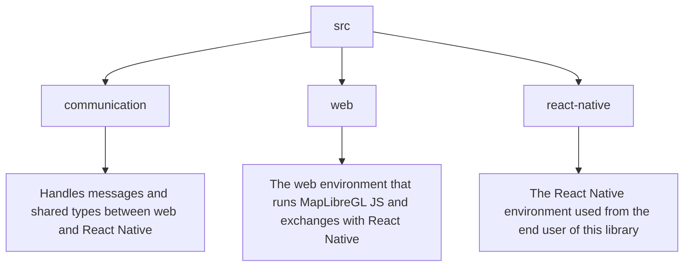

# How it works

** TODO rewrite this page **

## The main library mechanism

The library exposes React Native components that wrap MapLibre GL JS classes.
To communicate between the React Native world and the MapLibre GL JS (web)
world, the library uses a WebView component that runs the MapLibre GL JS code.
This WebView is wrapped within a `MapProvider` component that manages messages
between the two worlds. Then, within the provider, one can insert MapLibre GL JS
components such as `Map`, `Marker`, `Popup`, etc. as direct children.

## The React Native components

A component provided by this library is made of two parts:
- Props that are made of `options` and `listeners` based on the underlying
  MapLibre GL JS object.
- Ref that exposes methods and properties of the underlying MapLibre GL JS
  object.

When the component mount for the first time, a message is sent to the WebView,
through the `MapProvider`, to create the corresponding MapLibre GL JS
object with the `options` provided in props. Then, the web object subscribes to
the events specified in the `listeners` property.

When a component method is called, a message is sent through the `MapProvider`
to the WebView, where the corresponding MapLibre GL JS method is called. Then,
the result is sent back to the React Native world and returned to the caller
using a `Promise`.

The same mechanism is used for the listeners. When an event is triggered in the
WebView, a message is sent to the React Native world, where the corresponding
listener is called.

## TypeScript support

TypeScript usage makes it possible to infer every method, property and event
listener available on each component. These are directly mapped to the official
MapLibre GL JS documentation, with some adjustments to make it work in React
Native. The methods, properties and listeners that are modified are available in
the `{ComponentName}.types.ts` file.

## The code structure

The JS code that runs within the WebView is bundled using the script in the
[`scripts` folder (build.js)](./scripts/build.js). The generated code is in the
[`generated` folder](./src/web/generated). The main class being used by the code
is [`MapController`](./src/web/maplibre-gl-js/MapController.ts).

The types and messages that are sent to and by the WebView are stored within the
[`communication` folder](./src/communication).

## Developer jargon

The following terms are used throughout the documentation and codebase.

| Name       | Definition                                                                                                                                                                           |
|------------|--------------------------------------------------------------------------------------------------------------------------------------------------------------------------------------|
| RN world   | The React Native environment.                                                                                                                                                        |
| Web world  | The JS that runs within the React Native WebView (i.e. the code that runs the underlying MapLibre GL JS library). The corresponding code is stored in the [`web` folder](./src/web). |
| Web object | A MapLibre GL JS object running in the web world. The corresponding code is stored in the [`react-native` folder](./src/react-native).                                               |

## Current status

Here is a status of the MapLibre GL JS classes implemented in this library.

| Symbol | Definition             |
|--------|------------------------|
| 🖼️    | Frame                  |
| 🫟     | .addTo(map) view       |
| 🧩     | map.addSource(..) view |
| 🕹     | Control view           |
| 👆     | Gesture handler        |
| 📦     | Data container         |

| Implemented class | Type |
|-------------------|------|
| Map               | 🖼️  |
| Marker            | 🫟   |
| Popup             | 🫟   |

| To be implemented class          | Type |
|----------------------------------|------|
| AttributionControl               | 🕹️  |
| CanvasSource                     | 🧩   |
| GeoJSONSource                    | 🧩   |
| GlobeControl                     | 🕹️  |
| GlobeControl                     | 🕹️  |
| ImageSource                      | 🧩   |
| LogoControl                      | 🕹️  |
| NavigationControl                | 🕹️  |
| RasterDEMTileSource              | 🧩   |
| RasterTileSource                 | 🧩   |
| ScaleControl                     | 🕹️  |
| TerrainControl                   | 🕹️  |
| VectorTileSource                 | 🧩   |
| VideoSource                      | 🧩   |

The following table lists the MapLibre GL JS classes that are not implemented
because they are not relevant in the React Native context.

| Unsupported class                | Type | Reason                                           |
|----------------------------------|------|--------------------------------------------------|
| AJAXError                        | 📦   | No need to instantiated to use the public API.   |
| BoxZoomHandler                   | 👆   | No need to instantiated to use the public API.   |
| CooperativeGesturesHandler       | 👆   | No need to instantiated to use the public API.   |
| DoubleClickZoomHandler           | 👆   | No need to instantiated to use the public API.   |
| DragPanHandler                   | 👆   | No need to instantiated to use the public API.   |
| DragRotateHandler                | 👆   | No need to instantiated to use the public API.   |
| EdgeInsets                       | 📦   | No need to instantiated to use the public API.   |
| Event                            | 📦   | No need to instantiated to use the public API.   |
| Evented                          | 📦   | No need to instantiated to use the public API.   |
| FullscreenControl                | 🕹   | No need to control fullscreen.                   |
| Hash                             | 🫟   | Browser URL is not visible in WebView.           |
| KeyboardHandler                  | 👆   | No need to instantiated to use the public API.   |
| LngLat                           | 📦   | LngLatLike type is enough to provide coordinate. |
| LngLatBounds                     | 📦   | No need to instantiated to use the public API.   |
| MapMouseEvent                    | 📦   | No need to instantiated to use the public API.   |
| MapTouchEvent                    | 📦   | No need to instantiated to use the public API.   |
| MapWheelEvent                    | 📦   | No need to instantiated to use the public API.   |
| MercatorCoordinate               | 📦   | No need to instantiated to use the public API.   |
| ScrollZoomHandler                | 👆   | No need to instantiated to use the public API.   |
| Style                            | 📦   | No need to instantiated to use the public API.   |
| TwoFingersTouchPitchHandler      | 👆   | No need to instantiated to use the public API.   |
| TwoFingersTouchRotateHandler     | 👆   | No need to instantiated to use the public API.   |
| TwoFingersTouchZoomHandler       | 👆   | No need to instantiated to use the public API.   |
| TwoFingersTouchZoomRotateHandler | 👆   | No need to instantiated to use the public API.   |
